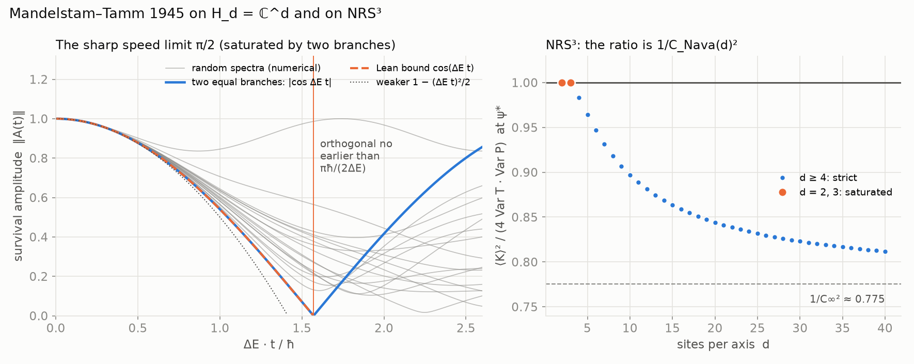
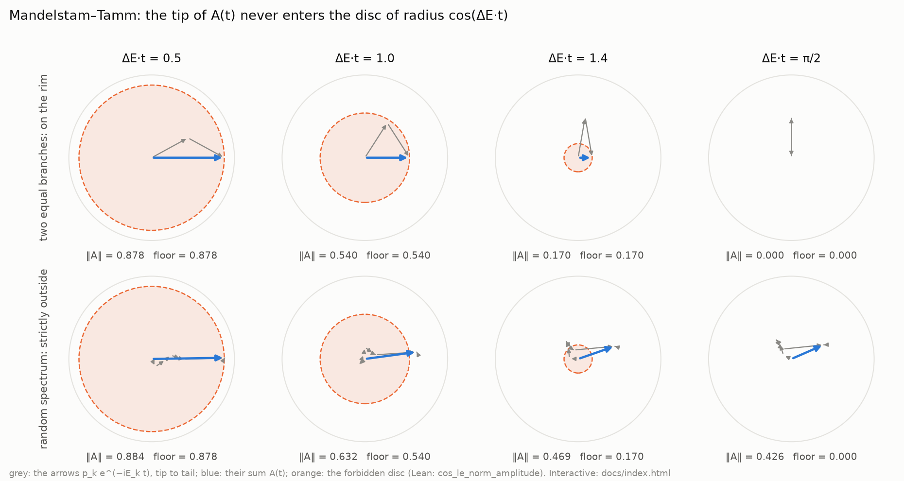

# NRS³ · Mandelstam–Tamm

**No quantum state becomes orthogonal to itself before `πħ / (2ΔE)`** — Mandelstam and Tamm's
speed limit with its sharp constant, proved in Lean 4.

**[▶ Try it: move the time and watch the phasors](https://naype888-cloud.github.io/nrs3-mandelstam-tamm/)**



## Results

| Statement | Lean |
|---|---|
| `‖A(t)‖ ≥ cos(ΔE t)` while `ΔE t ≤ π/2`, for every finite spectrum | `cos_le_norm_amplitude` |
| orthogonality forces `ΔE t ≥ π/2` | `orthogonality_time` |
| two equal branches meet it with equality: `π/2` is sharp | `norm_amplitude_half_eq_cos` |
| on `H_d = ℂ^d`: the Schrödinger evolution of a self-adjoint `H` has exactly this amplitude | `hasDerivAt_evolve`, `inner_evolve` |
| the bound on `ℂ^d` | `cos_le_norm_inner_evolve` |

`A(t) = ⟨ψ, e^{−iHt/ħ}ψ⟩` is the survival amplitude and `ΔE` the energy spread. It is the sum of
the arrows `p_k e^{−iE_k t}`; its tip never enters the disc of radius `cos(ΔE t)`:



## In NRS³

On the NRS³ pair `T_d : P_d` the same inequality bounds the speed of `⟨P_d⟩` by the spread of
transport, and at the maximal-tension state the ratio is `1 / C_Nava(d)²`: equality only at
`d = 2, 3` (`GroupVelocity.mandelstamTamm`, `GroupVelocity.mtRatio_psiStar`, `D41` in the base
repository). Right panel of the figure; the values there are numerical.

## History

Mandelstam and Tamm (1945) derived the bound from Robertson's inequality for the energy and the
projector on the initial state. The proof here follows that route: `P = ‖A‖²` obeys
`P' ≥ −2ΔE √(P(1 − P))`, and a fencing argument against `cos²` gives the sharp constant.

## Build

Lean 4 `v4.34.0`, Mathlib `v4.34.0`, nothing else.

```bash
lake exe cache get
lake build
lake env lean Verification/Axioms.lean   # only propext, Classical.choice, Quot.sound
```

Every file: no `sorry`, lines of at most 100 characters, English headers.

## The mosaic

- [NRS and NRS³ — the base theorem](https://github.com/naype888-cloud/nava-robertson-schrodinger)
- [NRS³ · Cramér–Rao](https://github.com/naype888-cloud/nrs3-cramer-rao)
- **[NRS³ · Mandelstam–Tamm](https://github.com/naype888-cloud/nrs3-mandelstam-tamm)** (this one)
- [NRS³ · Penrose](https://github.com/naype888-cloud/nrs3-penrose)
- [NRS³ · Pauli–Dirac](https://github.com/naype888-cloud/nrs3-pauli-dirac)
- [NRS³ · Poincaré](https://github.com/naype888-cloud/nrs3-poincare)

## License

NRS Noncommercial License 1.0.0, see [`LICENSE`](LICENSE). Author: Eduardo Nava-Hernandez.
